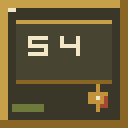
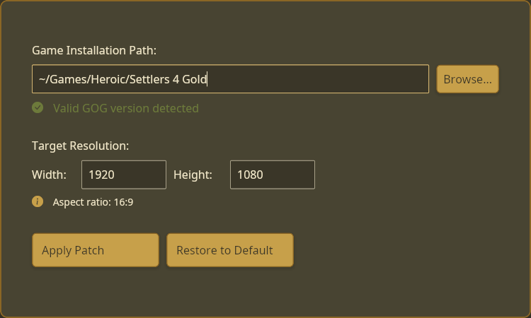

<h1 align="center">Settlers 4 Linux Widescreen Patcher</h1>

<p align="center">
  
</p>

<p align="center">
  <a href="https://github.com/RouHim/Settlers4LinuxPatcher/actions/workflows/ci.yml"></a>
  <a href="https://github.com/RouHim/Settlers4LinuxPatcher/releases/latest"></a>
  
</p>

<p align="center">
  <i>Linux-native patcher for <strong>The Settlers 4 – Gold Edition (GOG v2.50.1508)</strong>.</i>
</p>

<p align="center">
  
</p>

## Requirements

- The Settlers 4 – Gold Edition game files from GOG.com, version 2.50.1508.
- Linux obviously.

## Quick start

1. Download the latest Linux executable from
   the [Releases page](https://github.com/RouHim/Settlers4LinuxPatcher/releases/latest)
2. Make it executable (if your browser didn't preserve the bit):
   ```bash
   chmod +x Settlers4LinuxPatcher
   ```
3. Run the patcher:
   ```bash
   ./Settlers4LinuxPatcher    # launches the GUI
   ```

### Building from source

If you prefer to build from source:

```bash
git clone https://github.com/RouHim/Settlers4LinuxPatcher.git
cd Settlers4LinuxPatcher
cargo build --release
./target/release/Settlers4LinuxPatcher
```

## What gets patched

- `Exe/GfxEngine.dll`: the tool overwrites two 32-bit little-endian values at offsets `0x1068E` (width) and `0x10693` (
  height), starting from the embedded vanilla DLL, producing a fully patched replacement DLL for the chosen resolution.
- `Config/GameSettings.cfg`: sets `WindowWidth`, `WindowHeight`, forces `Fullscreen=1`, and `Screenmode=2` in the game’s
  custom INI format.
- No other files are touched. Restore rewrites both files back to the embedded vanilla defaults (1024×768).

## Known limitations

- Only the GOG Gold Edition v2.50.1508 hash is accepted; other editions are blocked.
- Assumes a Windows game installation under Wine/Proton.
- Resolution inputs are clamped to 800–7680 width and 600–4320 height.

## Troubleshooting

- **“Invalid version” banner:** You are not running the GOG Gold Edition v2.50.1508 `S4.exe`. Acquire the correct build.
- **Game is running:** Quit `S4.exe`/`S4_Main.exe` before applying or restoring patches.
- **Cannot find installation:** Place your Wine/Proton prefix under `~/Games`, or manually browse to the folder
  containing `S4.exe`.

## Development

- Build: `cargo build` or `cargo build --release`
- Run: `cargo run --release`
- Test: `cargo test`
- Lint/format: `cargo clippy` and `cargo fmt`
